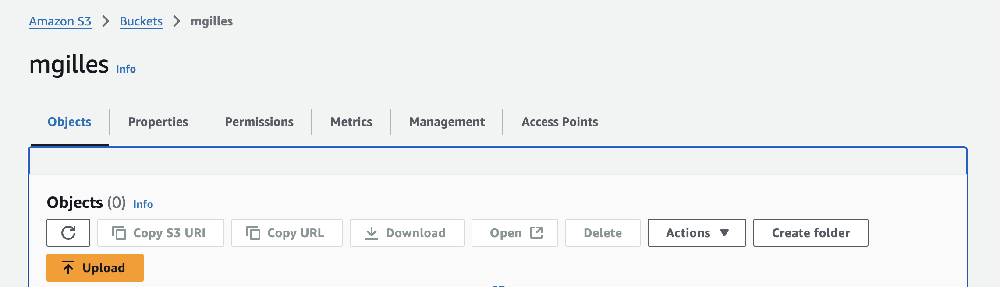
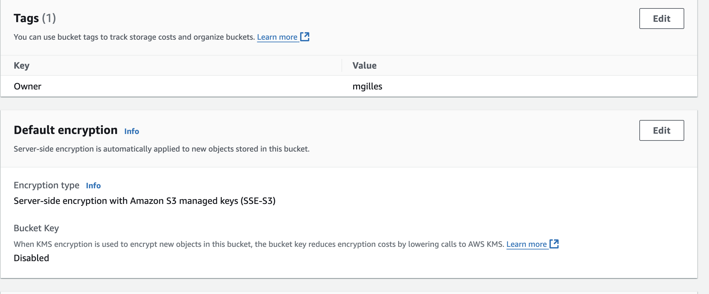
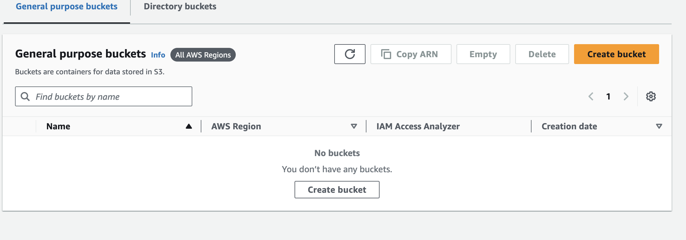

## 1. List Users IAM
```bash
users:~/environment $ aws iam list-users --profile formation-infra-cloud

{
    "Users": [
        {
            "Path": "/users/ynov/",
            "UserName": "afernandesjose",
            "UserId": "AIDAR6SW7FM7QHHNMO6SN",
            "Arn": "arn:aws:iam::134400125759:user/users/ynov/afernandesjose",
            "CreateDate": "2024-10-15T10:18:40+00:00",
            "PasswordLastUsed": "2024-11-04T08:58:30+00:00"
        },
        {
            "Path": "/",
            "UserName": "akiros-CI",
            "UserId": "AIDAR6SW7FM72MCTUHVH7",
            "Arn": "arn:aws:iam::134400125759:user/akiros-CI",
            "CreateDate": "2020-07-28T09:20:42+00:00"
        },
        {
            "Path": "/users/ynov/",
            "UserName": "apajak",
            "UserId": "AIDAR6SW7FM74FY3KXQLM",
            "Arn": "arn:aws:iam::134400125759:user/users/ynov/apajak",
            "CreateDate": "2024-10-15T10:18:40+00:00",
            "PasswordLastUsed": "2024-11-04T09:12:42+00:00"
        },
        {
            "Path": "/users/ynov/",
            "UserName": "apougearddulimbert",
            "UserId": "AIDAR6SW7FM77OEXJFDW5",
            "Arn": "arn:aws:iam::134400125759:user/users/ynov/apougearddulimbert",
            "CreateDate": "2024-10-15T10:18:40+00:00",
            "PasswordLastUsed": "2024-11-04T08:17:28+00:00"
        },
        {
            "Path": "/",
            "UserName": "bob",
            "UserId": "AIDAR6SW7FM74ZQ52PPFJ",
            "Arn": "arn:aws:iam::134400125759:user/bob",
            "CreateDate": "2021-06-30T15:30:51+00:00"
        },
        [...]

```

### 2. List Users in the path /users/ynov
```bash
users:~/environment $ aws iam list-users --path-prefix "/users/ynov/" --profile formation-infra-cloud

{
    "Users": [
        {
            "Path": "/users/ynov/",
            "UserName": "afernandesjose",
            "UserId": "AIDAR6SW7FM7QHHNMO6SN",
            "Arn": "arn:aws:iam::134400125759:user/users/ynov/afernandesjose",
            "CreateDate": "2024-10-15T10:18:40+00:00",
            "PasswordLastUsed": "2024-11-04T08:58:30+00:00"
        },
        {
            "Path": "/users/ynov/",
            "UserName": "apajak",
            "UserId": "AIDAR6SW7FM74FY3KXQLM",
            "Arn": "arn:aws:iam::134400125759:user/users/ynov/apajak",
            "CreateDate": "2024-10-15T10:18:40+00:00",
            "PasswordLastUsed": "2024-11-04T09:12:42+00:00"
        },
        {
            "Path": "/users/ynov/",
            "UserName": "apougearddulimbert",
            "UserId": "AIDAR6SW7FM77OEXJFDW5",
            "Arn": "arn:aws:iam::134400125759:user/users/ynov/apougearddulimbert",
            "CreateDate": "2024-10-15T10:18:40+00:00",
            "PasswordLastUsed": "2024-11-04T08:17:28+00:00"
        },
        {
            "Path": "/users/ynov/",
            "UserName": "clhuillier",
            "UserId": "AIDAR6SW7FM7TXMLYODQF",
            "Arn": "arn:aws:iam::134400125759:user/users/ynov/clhuillier",
            "CreateDate": "2024-10-15T10:18:40+00:00",
            "PasswordLastUsed": "2024-11-04T08:59:05+00:00"
        },
        {
            "Path": "/users/ynov/",
            "UserName": "edurand",
            "UserId": "AIDAR6SW7FM7QP6YDKYEY",
            "Arn": "arn:aws:iam::134400125759:user/users/ynov/edurand",
            "CreateDate": "2024-10-15T10:18:40+00:00",
            "PasswordLastUsed": "2024-11-04T09:06:54+00:00"
        },
        [...]


```

### 3. List Usernames in the path /users/ynov/
```bash
users:~/environment $ aws iam list-users --path-prefix "/users/ynov/" --query "Users[*].UserName" --profile formation-infra-cloud

[
    "afernandesjose",
    "apajak",
    "apougearddulimbert",
    "clhuillier",
    "edurand",
    "emestre",
    "fgarcia",
    "friviere",
    "hjarry",
    "jpaillusseau",
    "jtaillart",
    "kdussol",
    "lgarrabos",
    "lgasperment",
    "lgouasquet",
    "mgilles",
    "mhamond",
    "plarrode",
    "qvos",
    "rdanger",
    "rgebel",
    "sdelory",
    "tpavan"
]

```

# Exercise 2: Create a Bucket

```bash
users:~/environment $ aws s3api create-bucket --bucket mgilles --region eu-north-1 --create-bucket-configuration LocationConstraint=eu-north-1
{
    "Location": "http://mgilles.s3.amazonaws.com/"
}
```


### 3: Create a Bucket with a Tag

```bash
aws s3api put-bucket-tagging --bucket mgilles --tagging 'TagSet=[{Key=Owner,Value=mgilles}]' 
```



### 4 : Delete Bucket

```bash
aws s3api delete-bucket --bucket mgilles --region eu-north-1  
```

