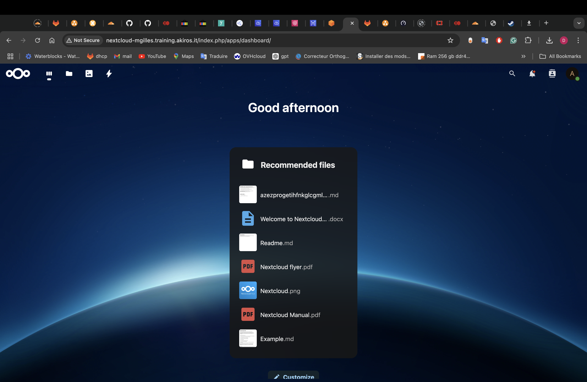

# Sommaire 

## TP 7

tout les fichier de conf sont dans le dossier TP7 [TP7](./tp7/)

### 1

fdnq `http://nextcloud-mgilles.training.akiros.it/`

possible depuis ["195.7.117.146/32"] uniquement (ynov)

Image de la page d'accueil de nextcloud 

