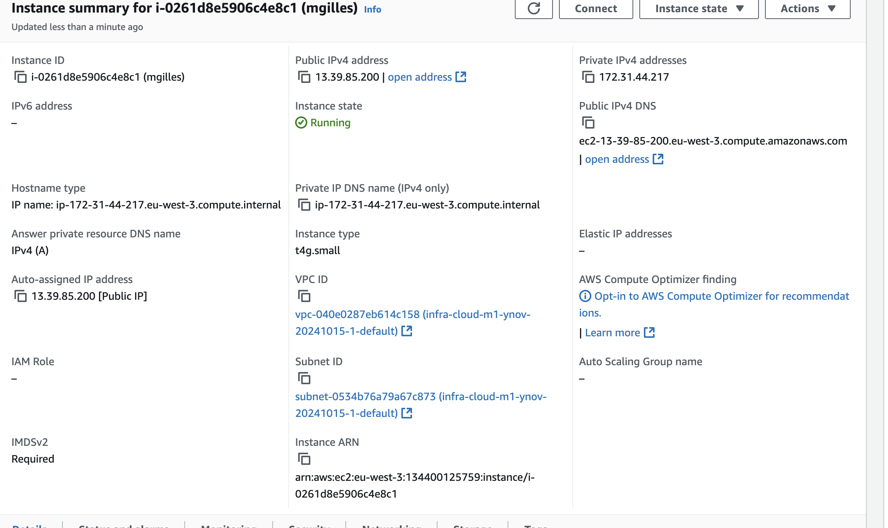
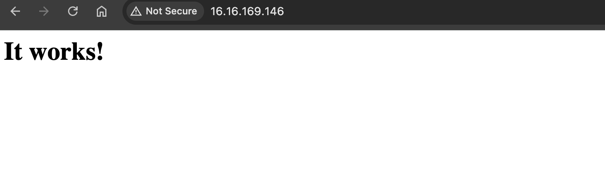

Rendu Cours Exercice 1 

| Région     | Type d'instance | vCPU | RAM   | Bande passante         | Coût horaire (EUR) |
|------------|-----------------|------|-------|------------------------|--------------------|
| Paris      | t3.small         | 2    | 2 GiB | Up to 5 Gigabit         | 0.0198             |
| Paris      | c6g.medium       | 1    | 2 GiB | Up to 10 Gigabit        | 0.0343             |
| Paris      | c6gd.medium      | 1    | 2 GiB | Up to 10 Gigabit        | 0.0391             |
| Milan      | t3.small         | 2    | 2 GiB | Up to 5 Gigabit         | 0.0203             |
| Milan      | c6g.medium       | 1    | 2 GiB | Up to 10 Gigabit        | 0.0401             |
| Milan      | c6gd.medium      | 1    | 2 GiB | Up to 10 Gigabit        | 0.0461             |
| Londres    | t4g.small        | 2    | 2 GiB | Up to 5 Gigabit         | 0.0173             |
| Londres    | t3.small         | 2    | 2 GiB | Up to 5 Gigabit         | 0.0214             |
| Londres    | c6g.medium       | 1    | 2 GiB | Up to 10 Gigabit        | 0.0343             |
| Irlande    | t3.small         | 2    | 2 GiB | Up to 5 Gigabit         | 0.0248             |
| Irlande    | c6g.medium       | 1    | 2 GiB | Up to 10 Gigabit        | 0.0401             |
| Francfort  | t3.small         | 2    | 2 GiB | Up to 5 Gigabit         | 0.0203             |
| Francfort  | c6g.medium       | 1    | 2 GiB | Up to 10 Gigabit        | 0.0365             |
| Espagne    | t3.small         | 2    | 2 GiB | Up to 5 Gigabit         | 0.0248             |
| Espagne    | c6g.medium       | 1    | 2 GiB | Up to 10 Gigabit        | 0.0401             |
| **Stockholm**  | **t4g.small**        | **2**    | **2 GiB** | **Up to 5 Gigabit**         | ***0.0162***             |
| Stockholm  | c6g.medium       | 1    | 2 GiB | Up to 10 Gigabit        | 0.0401             |
| Zurich     | t3.small         | 2    | 2 GiB | Up to 5 Gigabit         | 0.0248             |
| Zurich     | c6gd.medium      | 1    | 2 GiB | Up to 10 Gigabit        | 0.0461             |

# 1.1 
#### Le t4g.small de Stockholm semble etre un bon candidat et surtout suffisant pour nos besoins.

# 1.2

# 1.3/4

# 1.5

#### Instance ID : i-0ee0b4d388338d29b
#### Type d'instance : t4g.small
#### ID de l'AMI : ami-0dcbfe330b31195ff
#### IP publique : 13.51.251.99
#### FQDN public : ec2-13-51-251-99.eu-north-1.compute.amazonaws.com
#### IP privée : 172.31.2.99
#### ID du VPC : vpc-0dd372cf8bae91791
#### ID du sous-réseau : subnet-0330a3ea614d82bbe
#### AZ (Zone de disponibilité) : eu-north-1a
#### ID de l'interface réseau (Network Interface ID) : eni-0a999dbcc61dc3bf8
#### ID du volume EBS attaché : vol-0613be2109b60f1f7
#### Taille du volume EBS attaché : 8 Go

