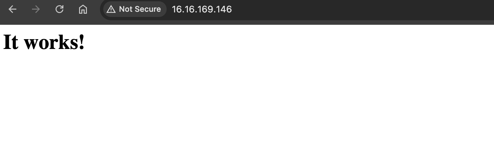
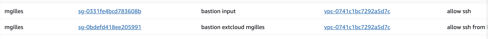
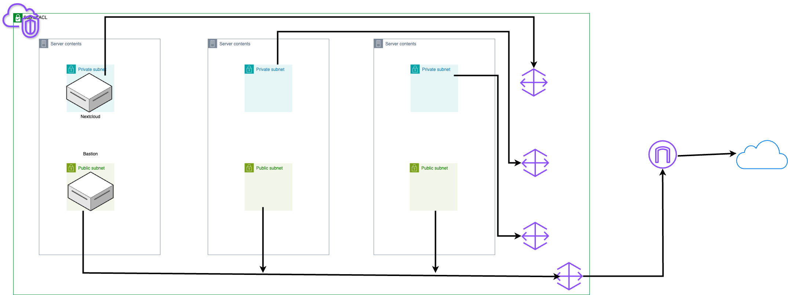

## Sommaire
- [TP 1](#tp-1)
    - [Exo 1](#exo-1)
    - [1](#1)
    - [2](#2)
    - [3 et 4](#3-et-4)
    - [5](#5)
- [Exo 2](#exo-2)
- [Exo 3](#exo-3)
    - [3.1](#31)
    - [3.2](#32)
    - [3.3](#33)
- [TP 2](#tp-2)
    - [Détails du VPC](#détails-du-vpc)
    - [VPC](#vpc)
    - [Subnets](#subnets)
    - [Internet Gateway](#internet-gateway)
    - [Tables de routage](#tables-de-routage)
    - [Liste de contrôle d'accès par défaut (ACL)](#liste-de-contrôle-daccès-par-défaut-acl)
    - [Security Group par défaut](#security-group-par-défaut)
- [Diagram](#diagram)
- [2](#2)


# TP 1 
## Exo 1
| Région     | Type d'instance | vCPU | RAM   | Bande passante         | Coût horaire (EUR) |
|------------|-----------------|------|-------|------------------------|--------------------|
| Paris      | t3.small         | 2    | 2 GiB | Up to 5 Gigabit         | 0.0198             |
| Paris      | c6g.medium       | 1    | 2 GiB | Up to 10 Gigabit        | 0.0343             |
| Paris      | c6gd.medium      | 1    | 2 GiB | Up to 10 Gigabit        | 0.0391             |
| Milan      | t3.small         | 2    | 2 GiB | Up to 5 Gigabit         | 0.0203             |
| Milan      | c6g.medium       | 1    | 2 GiB | Up to 10 Gigabit        | 0.0401             |
| Milan      | c6gd.medium      | 1    | 2 GiB | Up to 10 Gigabit        | 0.0461             |
| Londres    | t4g.small        | 2    | 2 GiB | Up to 5 Gigabit         | 0.0173             |
| Londres    | t3.small         | 2    | 2 GiB | Up to 5 Gigabit         | 0.0214             |
| Londres    | c6g.medium       | 1    | 2 GiB | Up to 10 Gigabit        | 0.0343             |
| Irlande    | t3.small         | 2    | 2 GiB | Up to 5 Gigabit         | 0.0248             |
| Irlande    | c6g.medium       | 1    | 2 GiB | Up to 10 Gigabit        | 0.0401             |
| Francfort  | t3.small         | 2    | 2 GiB | Up to 5 Gigabit         | 0.0203             |
| Francfort  | c6g.medium       | 1    | 2 GiB | Up to 10 Gigabit        | 0.0365             |
| Espagne    | t3.small         | 2    | 2 GiB | Up to 5 Gigabit         | 0.0248             |
| Espagne    | c6g.medium       | 1    | 2 GiB | Up to 10 Gigabit        | 0.0401             |
| **Stockholm**  | **t4g.small**        | **2**    | **2 GiB** | **Up to 5 Gigabit**         | ***0.0162***             |
| Stockholm  | c6g.medium       | 1    | 2 GiB | Up to 10 Gigabit        | 0.0401             |
| Zurich     | t3.small         | 2    | 2 GiB | Up to 5 Gigabit         | 0.0248             |
| Zurich     | c6gd.medium      | 1    | 2 GiB | Up to 10 Gigabit        | 0.0461             |


## 1 
#### Le t4g.small de Stockholm semble etre un bon candidat et surtout suffisant pour nos besoins.

## 2


## 3 et 4



## 5

#### Instance ID : i-0ee0b4d388338d29b
#### Type d'instance : t4g.small
#### ID de l'AMI : ami-0dcbfe330b31195ff
#### IP publique : 13.51.251.99
#### FQDN public : ec2-13-51-251-99.eu-north-1.compute.amazonaws.com
#### IP privée : 172.31.2.99
#### ID du VPC : vpc-0dd372cf8bae91791
#### ID du sous-réseau : subnet-0330a3ea614d82bbe
#### AZ (Zone de disponibilité) : eu-north-1a
#### ID de l'interface réseau (Network Interface ID) : eni-0a999dbcc61dc3bf8
#### ID du volume EBS attaché : vol-0613be2109b60f1f7
#### Taille du volume EBS attaché : 8 Go

# Exo 2


# Exo 3

## 3.1


## 3.2


## 3.3 
Rendu pas PDF exportable

Ici nous définissons en premiere le nom de l'instance. 2 secondes
Il faut cliquer sur *"additionnals tags"* afin d'ajouter en valeur *"Owner"* son utilisateur. 10 secondes
Ensuite nous choisissons Ubuntu sous ARM comme distribution et **t4g.small** come *instance type*. 3 secondes

Dans *Key pair login* met none
et dans Network Settings on séléctionne *Select existing security group* puis **Default**.


On peut plus bas encore choisir la taille du disk virtuel mais on laisseras ici 8gig. 

On peut ensuite cliquer a droite sur *Launch Instance* et on attend que notre VM se lance.
apres un court instant on clique sur l'id de la vm.


Une fois sur la console de management de l'instance, on clique sur *Connect* en haut a droite,
Ceci nous amene sur la console bash de la VM.

On rentreras ensuite la commande
```bash
sudo apt install -y apache2
```
et voila !, apache est installé et le site de base est online.

Il faut ensuite trouver *Public IPv4 address* la copier collé dans la bar de  navigation en haut est nous sommes sur notre site.
Ou sinon *Public IPv4 DNS* en la copaint elle aussi dans la bar de navigation **MAIS** en verifiant bien la suppréssion du **S** de **HTTPS**.

En moins de 5 minutes votre instance est lancée avec Apache d'installé.


# TP 2 

## Détails du VPC

## VPC
- **ID** : `vpc-0741c1bc7292a5d7c`
- **Nom (tag Name)** : `mgilles-vpc`
- **Plage d'adresses IP** : `10.0.0.0/16`

## Subnets
### mgilles-subnet-public2
- **ID** : `subnet-02fca9a1bceabb...`
- **Nom (tag Name)** : `mgilles-subnet-public2`
- **Plage d'adresses IP** : `10.0.16.0/20`
- **Zone de Disponibilité (AZ)** : `eu-north-1b`
- **Table de routage associée** : `acl-085ae6180e66b1a80`

### mgilles-subnet-public3
- **ID** : `subnet-0921864e0f4f4...`
- **Nom (tag Name)** : `mgilles-subnet-public3`
- **Plage d'adresses IP** : `10.0.32.0/20`
- **Zone de Disponibilité (AZ)** : `eu-north-1c`
- **Table de routage associée** : `acl-085ae6180e66b1a80`

### mgilles-subnet-private2
- **ID** : `subnet-0079b806caa8b...`
- **Nom (tag Name)** : `mgilles-subnet-private2`
- **Plage d'adresses IP** : `10.0.144.0/20`
- **Zone de Disponibilité (AZ)** : `eu-north-1b`
- **Table de routage associée** : `acl-085ae6180e66b1a80`

### mgilles-subnet-public1
- **ID** : `subnet-05147ec758846...`
- **Nom (tag Name)** : `mgilles-subnet-public1`
- **Plage d'adresses IP** : `10.0.0.0/20`
- **Zone de Disponibilité (AZ)** : `eu-north-1a`
- **Table de routage associée** : `acl-085ae6180e66b1a80`

### mgilles-subnet-private1
- **ID** : `subnet-012d8858f7484...`
- **Nom (tag Name)** : `mgilles-subnet-private1`
- **Plage d'adresses IP** : `10.0.128.0/20`
- **Zone de Disponibilité (AZ)** : `eu-north-1a`
- **Table de routage associée** : `acl-085ae6180e66b1a80`

### mgilles-subnet-private3
- **ID** : `subnet-036486cc22430...`
- **Nom (tag Name)** : `mgilles-subnet-private3`
- **Plage d'adresses IP** : `10.0.160.0/20`
- **Zone de Disponibilité (AZ)** : `eu-north-1c`
- **Table de routage associée** : `acl-085ae6180e66b1a80`

## Internet Gateway
- **ID** : `igw-0e0d954479f42ed82`
- **Nom (tag Name)** : `mgilles-igw
`

## Tables de routage
### Table de routage 1
- **ID** : `rtb-0c4e0f490d57be5ce`
- **Nom (tag Name)** : ` mgilles-rtb-private3-eu-north-1c`
- **Routes** :
 10.0.0.0/16 local

### Table de routage 2
- **ID** : `rtb-040b0156e76959ffa`
- **Nom (tag Name)** : `mgilles-rtb-private1-eu-north-1a`
- **Routes** :
 10.0.0.0/16 local

### Table de routage 3
- **ID** : `tb-0312a34680cfb4d33`
- **Nom (tag Name)** : `mgilles-rtb-private2-eu-north-1b`
- **Routes** :
 10.0.0.0/16 local


## Liste de contrôle d'accès par défaut (ACL)
- **ID** : `acl-085ae6180e66b1a80`

## Security Group par défaut
- **ID** : `sg-0331fe4bcd783608b`


# Diagram 


# 2

## Instance 1 - mgilles-nextcloud
- **ID** : `i-0bd42bba33ae8a7f2`
- **Nom (tag Name)** : `mgilles-nextcloud`
- **Type** : `t3.micro`
- **IP privée** : `10.0.142.28`
- **Subnet associé** : `mgilles-subnet-private1-eu-north-1a`
- **Security Group associé** : ``
- **Key Pair associé** : `nexcloud-mgilles`

## Instance 2 - mgilles-bastion
- **ID** : `i-0a67026a1f559aea8`
- **Nom (tag Name)** : `mgilles-bastion`
- **Type** : `t3.micro`
- **IP publique** : `16.171.111.160`
- **IP privée** : `10.0.3.120`
- **Subnet associé** : `mgilles-subnet-public1-eu-north-1a`
- **Security Group associé** : ``
- **Key Pair associé** : `bastion-out`

# Détails des Security Groups
## Security Group associé à mgilles-bastion



# Détails du Network ACL

- **ID** : `acl-085ae6180e66b1a80`
- **Nom (tag Name)** : `mgilles-vpc`

### Règles bastion ssh :
- **Règle 1** : `sgr-06a867e0f90db076c
IPv4
SSH
TCP
22
195.7.117.146/32
acces bastion`

### Règles nextcloud ssh :
- **Règle 1** : `	
sgr-00ebefa79983b6ddd
IPv4
SSH
TCP
22
10.0.3.120/32
acces from bastion
`

