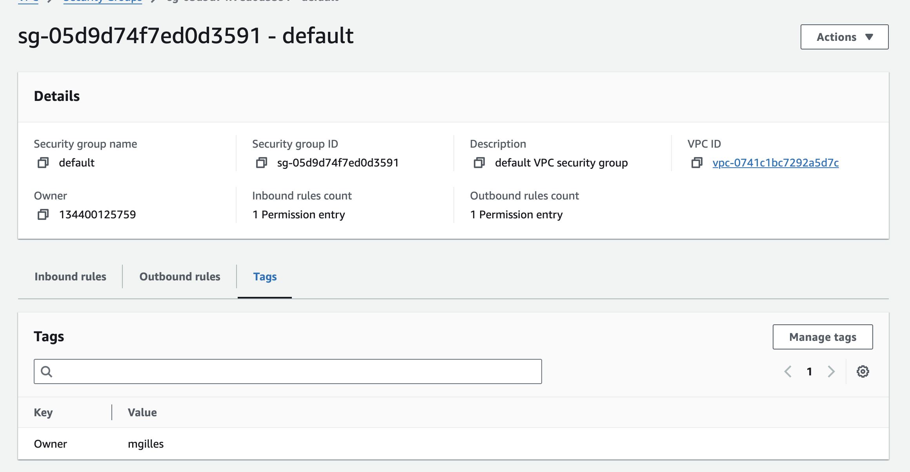

Rendu Cours Exercice 1 

| Région     | Type d'instance | vCPU | RAM   | Bande passante         | Coût horaire (EUR) |
|------------|-----------------|------|-------|------------------------|--------------------|
| Paris      | t3.small         | 2    | 2 GiB | Up to 5 Gigabit         | 0.0198             |
| Paris      | c6g.medium       | 1    | 2 GiB | Up to 10 Gigabit        | 0.0343             |
| Paris      | c6gd.medium      | 1    | 2 GiB | Up to 10 Gigabit        | 0.0391             |
| Milan      | t3.small         | 2    | 2 GiB | Up to 5 Gigabit         | 0.0203             |
| Milan      | c6g.medium       | 1    | 2 GiB | Up to 10 Gigabit        | 0.0401             |
| Milan      | c6gd.medium      | 1    | 2 GiB | Up to 10 Gigabit        | 0.0461             |
| Londres    | t4g.small        | 2    | 2 GiB | Up to 5 Gigabit         | 0.0173             |
| Londres    | t3.small         | 2    | 2 GiB | Up to 5 Gigabit         | 0.0214             |
| Londres    | c6g.medium       | 1    | 2 GiB | Up to 10 Gigabit        | 0.0343             |
| Irlande    | t3.small         | 2    | 2 GiB | Up to 5 Gigabit         | 0.0248             |
| Irlande    | c6g.medium       | 1    | 2 GiB | Up to 10 Gigabit        | 0.0401             |
| Francfort  | t3.small         | 2    | 2 GiB | Up to 5 Gigabit         | 0.0203             |
| Francfort  | c6g.medium       | 1    | 2 GiB | Up to 10 Gigabit        | 0.0365             |
| Espagne    | t3.small         | 2    | 2 GiB | Up to 5 Gigabit         | 0.0248             |
| Espagne    | c6g.medium       | 1    | 2 GiB | Up to 10 Gigabit        | 0.0401             |
| **Stockholm**  | **t4g.small**        | **2**    | **2 GiB** | **Up to 5 Gigabit**         | ***0.0162***             |
| Stockholm  | c6g.medium       | 1    | 2 GiB | Up to 10 Gigabit        | 0.0401             |
| Zurich     | t3.small         | 2    | 2 GiB | Up to 5 Gigabit         | 0.0248             |
| Zurich     | c6gd.medium      | 1    | 2 GiB | Up to 10 Gigabit        | 0.0461             |


# 1.1 
#### Le t4g.small de Stockholm semble etre un bon candidat et surtout suffisant pour nos besoins.

# 1.2


# 1.3/4


# 1.5

#### Instance ID : i-0ee0b4d388338d29b
#### Type d'instance : t4g.small
#### ID de l'AMI : ami-0dcbfe330b31195ff
#### IP publique : 13.51.251.99
#### FQDN public : ec2-13-51-251-99.eu-north-1.compute.amazonaws.com
#### IP privée : 172.31.2.99
#### ID du VPC : vpc-0dd372cf8bae91791
#### ID du sous-réseau : subnet-0330a3ea614d82bbe
#### AZ (Zone de disponibilité) : eu-north-1a
#### ID de l'interface réseau (Network Interface ID) : eni-0a999dbcc61dc3bf8
#### ID du volume EBS attaché : vol-0613be2109b60f1f7
#### Taille du volume EBS attaché : 8 Go

# 2


# 3

## 3.1


## 3.2


## 3.3 
Rendu pas PDF exportable

Ici nous définissons en premiere le nom de l'instance. 2 secondes
Il faut cliquer sur *"additionnals tags"* afin d'ajouter en valeur *"Owner"* son utilisateur. 10 secondes
Ensuite nous choisissons Ubuntu sous ARM comme distribution et **t4g.small** come *instance type*. 3 secondes

Dans *Key pair login* met none
et dans Network Settings on séléctionne *Select existing security group* puis **Default**.


On peut plus bas encore choisir la taille du disk virtuel mais on laisseras ici 8gig. 

On peut ensuite cliquer a droite sur *Launch Instance* et on attend que notre VM se lance.
apres un court instant on clique sur l'id de la vm.


Une fois sur la console de management de l'instance, on clique sur *Connect* en haut a droite,
Ceci nous amene sur la console bash de la VM.

On rentreras ensuite la commande
```bash
sudo apt install -y apache2
```
et voila !, apache est installé et le site de base est online.

Il faut ensuite trouver *Public IPv4 address* la copier collé dans la bar de  navigation en haut est nous sommes sur notre site.
Ou sinon *Public IPv4 DNS* en la copaint elle aussi dans la bar de navigation **MAIS** en verifiant bien la suppréssion du **S** de **HTTPS**.

En moins de 5 minutes votre instance est lancée avec Apache d'installé.


# TP 2 





# Diagram 

